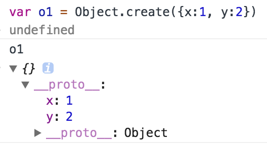
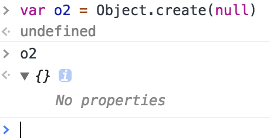
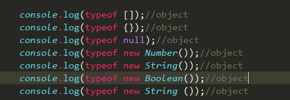
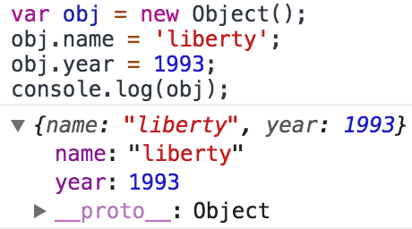
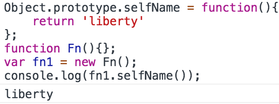
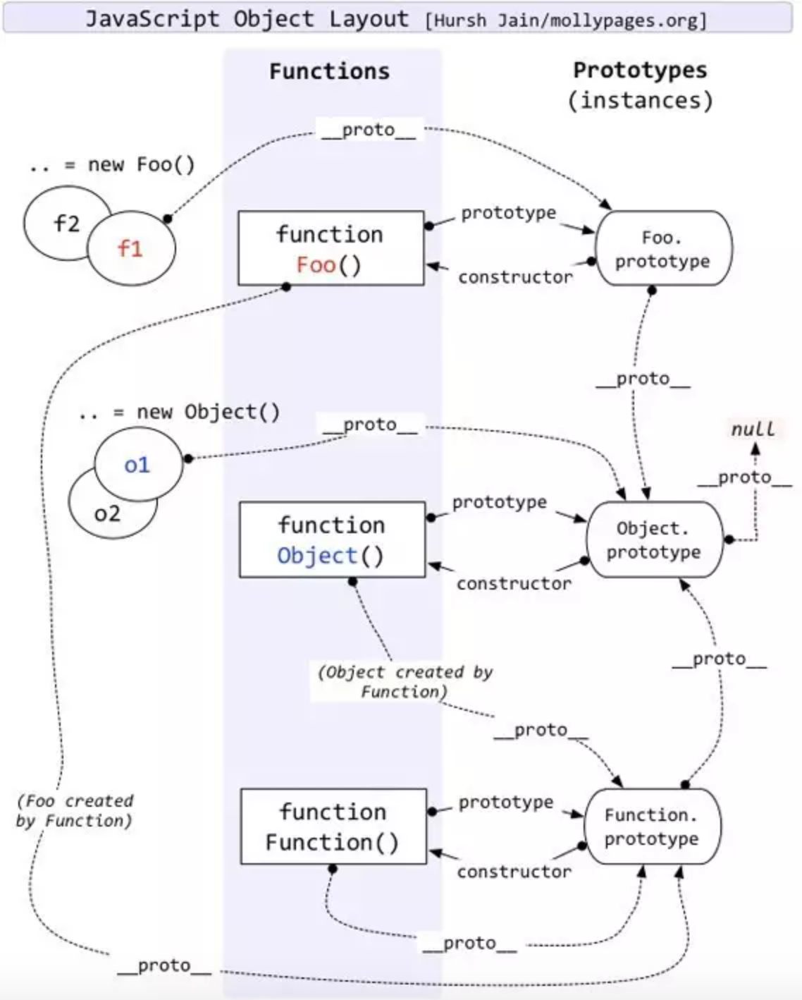

<!--### ECMASCRIPT5.1

文章链接        |     文章内容       | 创建日期     |
--------------------|------------------|-----------------------|
 | 对象   |  2018-03-17   |-->
 
## <p align="center">你需要深入了解一下对象</p>
日常开发中，object接触的很多很多，{}，这个都不陌生，对象是一种复合值，它将很多值聚合在了一起，对象除了自有的属性，还会从一个原型（prototype）对象继承属性，对它的常见的用法有创建（create）、设置（set）、查找(query)、删除（delete）、检测（test）、枚举（enumerate）

## 1.创建对象
```
1. var obj = {}  //对象直接量
2. var obj1 = new Object() //调用new
3. var obj2 = Object.create(Object.prototype)//创建一个有继承Object.prototype的空对象
```
<h4>1.Object.create(param1, param2)</h4>
<p>该方法会创建一个新的对象,第一个参数是这个对象要继承的原型，第二个可选参数是propertiesObject()</p>

<br/>

```
var o1 = Object.create({x:1, y:2})//o1继承了属性x和y
```


以上是创建一个名为o1的对象，同时给它的原型上面继承了{x:1, y:2}，这些属性不在对象自身上面。

<br/>

```
var o2 = Object.create(null)//o2不继承任何属性和方法，以及toString()
```


以上是创建一个名为o2的对象，传递null，o2对象不具备任何属性和方法

## 2.继承
js的继承是基于原型链来继承的，原型链是js的比较难懂的一点，先说一些ECMASCRIPT的数据类型分为原始类型和引用类型：

        原始类型：有五种，undefined、null、Boolean、number和String;

        引用类型：对象、数组、函数；
        

据我所学的知识里边，引用类型只有object一种



<br/>


<br/>
上面的这个例子可以说明对象是由函数创建，对象直接量创建方法是一种语法糖，简化了很多步骤。
例如:



<br/>	
现在可以确定对象是由函数来创建的，但函数也是一种对象。这里有点绕，对象由函数创建，函数也是一种对象。


<br/>
所有可执行的对象typeof运算都将返回‘function’，继续上面的问题，对象是由函数创建，那么函数是由谁来创建？是由Function函数创建的。


这里大致的道清了一些函数与对象的渊源，仔细观察一下每个对象都有一个隐藏的属性__proto__，这个称为隐式原型，它引用了创建这个对象函数的prototype


下面用一段话总结原型过程；

var fn1 = new fn();

fn1对象只有__proto__，没有prototype, fn1.__proto__指向了创建该对象函数的prototype,即fn.prototype,fn.prototype是一个对象，fn.prototype的__prototype指向Object.prototype,Object.prototype.__proto__为null;
以上称为js原型链，js继承机制是原型链。




以上fn1自身是没有selfName方法的，会沿着原型对象向上查询，如果原型对象中也没有selfName，但这个原型对象还有原型，那么继续向上查询，一直查询到Object.prototype.__proto__为止，
假设给对象o.x赋值，如果o自身属性有x，那么只会改变自有属性，如果不存在这个属性，那么将给o新添加一个x属性。

原型链走图可以看一下下面这张图：来自http://www.ibm.com/developerworks/cn/web/1306_jiangjj_jsinstanceof/figure1.jpg


所有的可执行对象都是Object的子集，给Object.prototype添加的属性和方法，其它的对象都可以读取到，这个就是js的继承和原型链。

## 3.删除属性

有的时候会删除对象中的某一个属性，用delete运算符，可以删除对象自有的属性，不能删除继承的属性，如果一个对象引用另一个对象，调用delete删除宿主对象，这时的delete只是断开属性和宿主对象的联系。

```
var a = {p:{x:1}};
var b = a.p;
delete a.p; //true
console.log(b); //{x:1}
console.log(a); //{}
```
## 4.检测属性
经常会一个对象是否存在某个属性，可以用到in、hasOwnProperty、propertyIsEnumerable；

<h5>1.in运算符</h5>

in运算符会检测属性是否存在对象上以及原型上；

```
var o = {x: 1};
'x' in o;   //true 'x'是o的属性
'y' in o;   //false 'y'不是o的属性
'toString' in o  //true o继承toString属性
```

<h5>2.hasOwnProperty(param) </h5>

该方法来检测给定的名字是否是对象的属性

```
var o = {x: 1};
o.hasOwnProperty('x');   //true 'x'是o的属性
o.hasOwnProperty('y');   //false 'y'不是o的属性
o.hasOwnProperty('toString');  //false o继承toString属性,不是自有属性
```

<h5>3.propertyIsEnumerable(param) </h5>

该方法来检测给定的名字是否是对象的自有属性且这个属性可枚举性为true它会返回true，继承来的属性为false；

```
var o = inherit({y:2});
o.x = 1;
o. propertyIsEnumerable('x'); //true x为可枚举的自有属性
o. propertyIsEnumerable('y'); //false y是继承过来的
Object.prototype. propertyIsEnumerable('toString'); // false 不可枚举
```

## 5.枚举属性
经常遍历对象的属性，用到for/in、Object.keys()、Object.getOwnPropertyNames()，for/in这个方法会枚举出所有可枚举的属性和继承的属性，如果想要得到自身的属性，需要做一些处理。
Object.keys()返回一个数组，内容是对象可枚举属性的自有属性。
Object.getOwnPropertyNames()和Object.keys()一样都是返回数组，但它返回的是所有自有属性，不仅仅是可枚举的。


## 6.getter和setter

```
var o = {
        x: 1,
        get r(){
            return this.x+1;
        },
        set l(param){
            this.x += param;
        }
    };
    console.log(o.x); //1
    console.log(o.r); //2
    o.l = 20; //进行赋值
    console.log(o.x); //21
    console.log(o.r); //22
```

## 7.属性的特征
对象除了包含属性名和属性值以外，还有一些标识它们是否可写(writable)、可枚举(enumerable)、可配置性(configurable)。
Object.getOwnPropertyDescriptor(obj, param)获得某个对象的属性的属性描述符

```
// 返回{configurable:true,enumerable:true,writable:true,value:1}
Object.getOwnPropertyDescriptor({x:1}, 'x')
```

Object.defineProperty(obj, param, config) 设置属性的特性

```
var o = {};
Object.defineProperty(o, 'x', {
	value: 1,
	writable: true,
	enumerable: false,
	configurable: true
})
console.log(o.x)   //1
console.log(Object.keys(o))  //[]  x存在，但不可枚举


Object.defineProperty(o, 'x', {
	writable: false  //变为只读
})
o.x = 20;
console.log(o.x) //1  不可写


Object.defineProperty(o, 'x', {value: 20});
console.log(o.x)  //20   这里为20是属性为可配置的，如果把configurable:false就是不可配置的
```

## 8.序列化对象
将对象转成字符串，再将字符串转成对象，一般可以用作对象深拷贝

```
var o = {
        key1: 1,
        key2: [1, 2, 3],
        key3: {
            a: 1,
            b: 2,
            c: 3
        }
    }
var s = JSON.stringify(o)  //'{"key1":1,"key2":[1,2,3],"key3":{"a":1,"b":2,"c":3}}'

var p = JSON.parse(s) // p是o的深拷贝

```