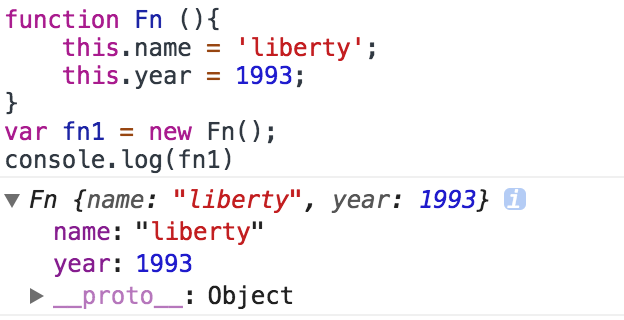

<!--### ECMASCRIPT5.1

文章链接        |     文章内容       | 创建日期     |
--------------------|------------------|-----------------------|
 | 对象   |  2018-03-17   |-->
 
## <p align="center">你需要深入了解一下对象</p>
日常开发中，object接触的很多很多，{}，这个都不陌生，对象是一种复合值，它将很多值聚合在了一起，对象除了自有的属性，还会从一个原型（prototype）对象继承属性，对它的常见的用法有创建（create）、设置（set）、查找(query)、删除（delete）、检测（test）、枚举（enumerate）

## 1.创建对象
```
1. var obj = {}  //对象直接量
2. var obj1 = new Object() //调用new
3. var obj2 = Object.create(Object.prototype)//创建一个有继承Object.prototype的空对象
```
<h4>1.Object.create(param1, param2)</h4>
<p>该方法会创建一个新的对象,第一个参数是这个对象要继承的原型，第二个可选参数是propertiesObject()</p>

<br/>

```
var o1 = Object.create({x:1, y:2})//o1继承了属性x和y
```


以上是创建一个名为o1的对象，同时给它的原型上面继承了{x:1, y:2}，这些属性不在对象自身上面。

<br/>

```
var o2 = Object.create(null)//o2不继承任何属性和方法，以及toString()
```


以上是创建一个名为o2的对象，传递null，o2对象不具备任何属性和方法

##2.继承
js的继承是基于原型链来继承的，原型链是js的比较难懂的一点，先说一些ECMASCRIPT的数据类型分为原始类型和引用类型：

        原始类型：有五种，undefined、null、Boolean、number和String;

        引用类型：对象、数组、函数；
        

据我所学的知识里边，引用类型只有object一种


<br/>


<br/>
上面的这个例子可以说明对象是由函数创建，对象直接量创建方法是一种语法糖，简化了很多步骤。
例如:


<br/>	
现在可以确定对象是由函数来创建的，但函数也是一种对象。这里有点绕，对象由函数创建，函数也是一种对象。


<br/>
所有可执行的对象typeof运算都将返回‘function’，继续上面的问题，对象是由函数创建，那么函数是由谁来创建？是由Function函数创建的。


这里大致的道清了一些函数与对象的渊源，仔细观察一下每个对象都有一个隐藏的属性__proto__，这个称为隐式原型，它引用了创建这个对象函数的prototype


下面用一段话总结原型过程；

var fn1 = new fn();

fn1对象只有__proto__，没有prototype, fn1.__proto__指向了创建该对象函数的prototype,即fn.prototype,fn.prototype是一个对象，fn.prototype的__prototype指向Object.prototype,Object.prototype.__proto__为null;
以上称为js原型链，js继承机制是原型链。


以上fn1自身是没有selfName方法的，会沿着原型对象向上查询，如果原型对象中也没有selfName，但这个原型对象还有原型，那么继续向上查询，一直查询到Object.prototype.__proto__为止，